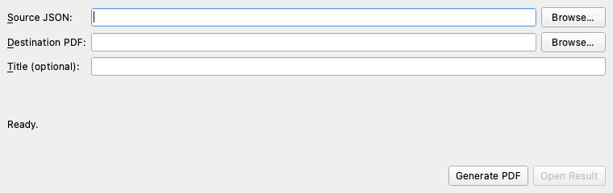

# JSON-to-PDF

An offline desktop application that turns one generic JSON object or array into a readable, searchable PDF.



## Supported platforms

- Windows 10/11 x86-64
- macOS 13 or newer, universal2
- Linux x86-64 with glibc 2.34 or newer

Native standalone builds are produced on each operating system; cross-compilation is not supported. The release checklist must be complete before an artifact is described as release-ready.

## Install and run from source

Python 3.12 is required.

macOS/Linux:

```bash
python3.12 -m venv .venv
source .venv/bin/activate
python -m pip install -r requirements.lock
python -m pip install -e .
python -m json_to_pdf
```

Windows PowerShell or Command Prompt (activation is not required):

```powershell
py -3.12 -m venv .venv
.\.venv\Scripts\python.exe -m pip install -r requirements.lock
.\.venv\Scripts\python.exe -m pip install -e .
.\.venv\Scripts\python.exe -m json_to_pdf
```

For a non-installed checkout, use `PYTHONPATH=src python -m json_to_pdf`. On headless Linux, prefix test commands with `QT_QPA_PLATFORM=offscreen`.

## Use the application

1. Choose one `.json` source file.
2. Choose a `.pdf` destination.
3. Optionally enter a title; blank uses the source filename stem.
4. Select **Generate PDF** and wait for the success status.
5. Select **Open Result**, or open the saved file in a PDF viewer.

Every control is keyboard-operable, labels have programmatic buddies/names, tab order follows this workflow, progress is visible, and errors are actionable. The generated PDF uses logical heading levels, at least 10 pt body text, dark text on white, 135% line height, and selectable/searchable text. Tagged PDF and PDF/UA conformance are not claimed.

## Input policy and limits

Input must be UTF-8; a UTF-8 BOM is accepted. The root must be a non-empty object or array. Empty roots, scalar roots, invalid JSON, and `NaN`/`Infinity` constants are rejected. JSON number spelling is preserved rather than converted through binary floating point.

| Limit | Maximum |
|---|---:|
| Input file | 20 MiB |
| Nesting depth | 32 |
| JSON values, including containers and root | 200,000 |
| Each object key or string | 100,000 characters |
| Each number lexeme | 1,000 characters |
| Document title | 200 characters |
| Output pages | 2,000 |
| Generated PDF | 250 MiB |

The exact bundled Noto Sans v2.015 repertoire is supported and checked before rendering. It includes Turkish, Latin, Greek, and Cyrillic; universal Unicode coverage is not claimed. Unsupported printable characters are rejected by code point instead of silently using a system-font fallback.

## Privacy, safety, and errors

Conversion is local and offline. The runtime contains no telemetry, accounts, cloud service, URL fetching, or network access. URLs, file-looking strings, and HTML-looking strings in JSON are escaped and printed literally; they are never followed, loaded, or interpreted, and images are not embedded.

Public failures use stable categories: input read, invalid JSON, input policy, resource limit, unsupported character, rendering, PDF validation, and output write. Messages do not expose JSON values, full paths, or internal exception text. Output is validated before same-directory replacement; a failed conversion preserves an existing destination and normally cleans its temporary file. Atomic replacement is used where the operating system guarantees it, but crash durability is not claimed.

## Build and verify

```bash
python -m pytest -q
python -m compileall -q src tests
pyside6-deploy -c pysidedeploy.spec
```

Standalone release builds use pinned Nuitka through `pyside6-deploy`. The pull-request workflow runs the same acceptance matrix on Windows, macOS, and Linux. See [the quality checklist](docs/quality-checklist.md), [third-party notices](THIRD_PARTY_NOTICES.md), and [the implementation loop](docs/implementation-loop.md).

## V1 boundaries

V1 does not provide batch conversion, image decoding/embedding, a browser preview, templates, themes, plugins, a web server, accounts, a database, telemetry, or cloud features. It does not claim PDF/UA/tagged-PDF conformance, universal Unicode coverage, crash durability, or release legal approval.
